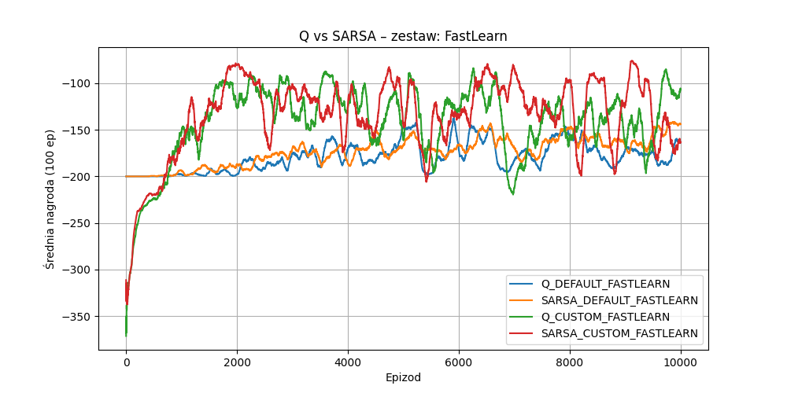
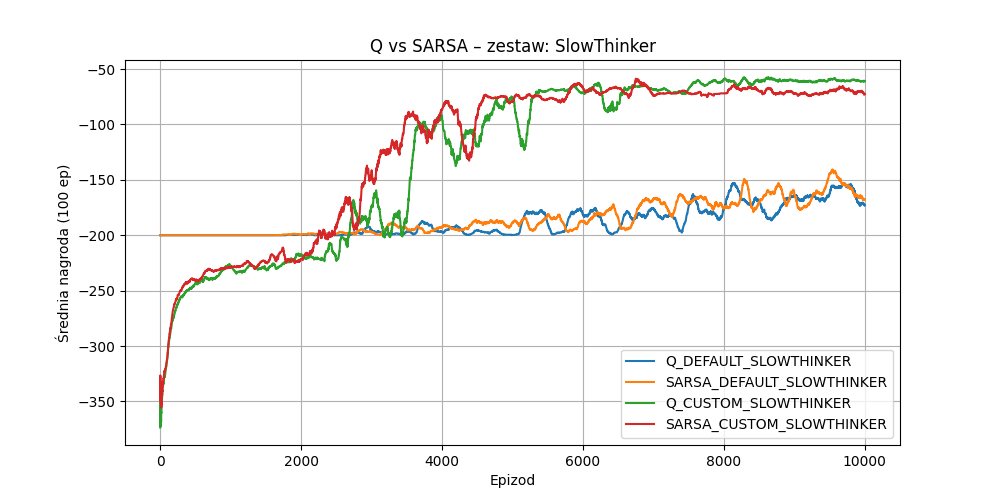

# Mountain Car Q-Learning and SARSA Implementation

This project implements and compares Q-Learning and SARSA algorithms for solving the Mountain Car problem from OpenAI Gymnasium. The agent learns to drive an underpowered car up a mountain by swinging back and forth to build momentum.

## Project Structure

- `mountain_car.py` - Main implementation file containing the training loop and visualization code
- `functions.py` - Helper functions including training implementations for both Q-Learning and SARSA
- Visualization outputs (graphs and videos) showing the learning progress

## Algorithm Variants and Parameters

We tested different parameter sets to compare their performance:

1. **Baseline**: α=0.2, γ=0.99, ε-decay=0.995
2. **FastLearn**: α=0.5, γ=0.95, ε-decay=0.99
3. **SlowThinker**: α=0.1, γ=0.99, ε-decay=0.995
4. **FutureSeeker**: α=0.2, γ=0.999, ε-decay=0.997
5. **Explorator**: α=0.2, γ=0.99, ε-decay=0.999

Where:
- α (alpha) - learning rate
- γ (gamma) - discount factor
- ε (epsilon) - exploration rate with decay

## Learning Progress

### Training Graphs

The following graphs show the learning progress for different parameter sets:

*Baseline configuration comparing Q-Learning and SARSA with default and custom rewards*

*Fast Learning configuration with higher learning rate and faster exploration decay*

*Slow Learning configuration with lower learning rate*

*Future-oriented configuration with higher discount factor*

*Exploration-focused configuration with slower epsilon decay*

### Video Demonstrations

The repository includes video demonstrations of the trained agents:

1. `run_1_q_custom_FastLearn_2k.mp4` - Shows the performance of Q-Learning agent with FastLearn parameters after 2000 episodes
2. `run_1_q_custom_SlowThinker_10k.mp4` - Shows the performance of Q-Learning agent with SlowThinker parameters after 10000 episodes
3. `mountaincar_agent_run_not_trained.mp4` - Shows the behavior of an untrained agent for comparison

## Implementation Details

### State Space Discretization
- Position space: [-1.2, 0.6] divided into 40 bins
- Velocity space: [-0.07, 0.07] divided into 40 bins

### Action Space
- 0: Push left
- 1: No push
- 2: Push right

### Reward Structures

The project implements two reward structures:

1. **Default Reward**: -1 for each step, 0 for reaching the goal
2. **Custom Reward**: Modified to encourage momentum building and reaching higher positions:
   - Base reward: -1 per step
   - Velocity bonus: Proportional to absolute velocity
   - Position bonus: Proportional to height achieved
   - Goal bonus: +100 for reaching the target

## Results Analysis

The graphs show the average reward over 100 episodes for different configurations. Key observations:

- FastLearn configuration achieves quick initial improvements but may be less stable
- SlowThinker shows more consistent but slower learning
- Custom reward structure generally leads to better performance
- Q-Learning and SARSA show similar performance patterns but with different stability characteristics

## Dependencies

- Python 3.x
- gymnasium
- numpy
- matplotlib
- PIL
- imageio (with FFMPEG backend)
